<p align="center">
  
  
  
  
</p>

<h1 align="center">🔀 CliRelay</h1>

<p align="center">
  <strong>统一的 AI CLI 代理服务器 — 用你<em>现有的</em>订阅接入任何 OpenAI / Gemini / Claude / Codex 兼容客户端。</strong>
</p>

<p align="center">
  <a href="README.md">English</a> | 中文
</p>

<p align="center">
  <a href="https://help.router-for.me/cn/">📖 文档</a> ·
  <a href="https://github.com/kittors/codeProxy">🖥️ 管理面板</a> ·
  <a href="https://github.com/kittors/CliRelay/issues">🐛 报告问题</a> ·
  <a href="https://github.com/kittors/CliRelay/pulls">✨ 功能请求</a>
</p>

---

## ⚡ CliRelay 是什么？

> **✨ 基于 [CLIProxyAPI](https://github.com/router-for-me/CLIProxyAPI) 的深度增强版** — 补强了生产级管理层、Web 控制面板托管能力，以及面向日常运维的终端 TUI。

CliRelay 让你可以把 AI 编程工具和兼容 API 客户端（Claude Code、Gemini CLI、OpenAI Codex、Amp CLI、任意 OpenAI 兼容客户端等）的请求**统一代理**到一个端点。你可以混合使用 OAuth、API Key、Cookie 等凭据，CliRelay 会自动处理路由、故障转移、用量日志、`/manage` Web 面板托管和终端管理流程。

```
┌───────────────────────┐         ┌──────────────┐         ┌────────────────────┐
│   AI 编程工具          │         │              │         │  上游服务商          │
│                       │         │              │ ──────▶ │  Google Gemini      │
│  Claude Code          │ ──────▶ │   CliRelay   │ ──────▶ │  OpenAI / Codex    │
│  Gemini CLI           │         │   :8317      │ ──────▶ │  Anthropic Claude  │
│  OpenAI Codex         │         │              │ ──────▶ │  Qwen / iFlow      │
│  Amp CLI / IDE        │         │              │ ──────▶ │  Antigravity       │
│  任意 OAI 兼容客户端   │         └──────────────┘         │  Vertex / OpenAI   │
└───────────────────────┘                                  │  iFlow / Qwen /    │
                                                           │  Kimi / Claude     │
                                                           └────────────────────┘
```

## ✨ 核心特性

### 🔌 多服务商代理引擎

| 特性 | 说明 |
|:-----|:-----|
| 🌐 **统一端点** | 一个 `http://localhost:8317` 统一承接 Gemini、Claude、Codex、Qwen、iFlow、Antigravity、Vertex 兼容端点、OpenAI 兼容上游以及 Amp 集成 |
| ⚖️ **智能负载均衡** | 跨多个 API Key 的轮询或填充优先调度策略 |
| 🔄 **自动故障转移** | 配额耗尽或发生错误时自动切换到备用渠道 |
| 🧠 **多模态支持** | 完整支持文本 + 图片输入、Function Calling（工具调用）和 SSE 流式响应 |
| 🔗 **OpenAI 兼容** | 支持任何兼容 OpenAI Chat Completions 协议的上游服务 |

### 📊 请求日志与监控（SQLite）

| 特性 | 说明 |
|:-----|:-----|
| 📝 **完整请求捕获** | 每个 API 请求记录到 SQLite：时间戳、模型、Token（输入/输出/推理/缓存）、延迟、状态、来源渠道 |
| 💬 **消息体存储** | 完整的请求/响应消息内容以压缩形式存入 SQLite，并支持将正文保留策略与元数据保留策略分离 |
| 🔍 **高级查询** | 按 API Key、模型、状态、时间范围过滤日志，高效分页（LIMIT/OFFSET） |
| 📈 **分析聚合** | 预计算仪表盘：每日趋势、模型分布、每小时热力图、单 Key 统计 |
| 🏥 **健康评分引擎** | 实时 0–100 健康评分，综合考虑成功率、延迟、活跃渠道和错误模式 |
| 📡 **WebSocket 监控** | 通过 WebSocket 实时推送系统状态：CPU、内存、goroutines、网络 I/O、数据库大小 |
| 🗄️ **No-CGO SQLite** | 使用 `modernc.org/sqlite` — 纯 Go 实现，无 CGO 依赖，易于交叉编译 |

### 🔐 API Key 与权限管理

| 特性 | 说明 |
|:-----|:-----|
| 🔑 **API Key CRUD** | 通过管理 API 创建、编辑、删除 API Key — 支持自定义名称、备注和独立启用/禁用开关 |
| 📊 **单 Key 配额** | 为每个 Key 设置最大 Token / 请求配额，系统自动执行限制 |
| ⏱️ **速率限制** | 单 Key 速率限制（每分钟/每小时请求数） |
| 🔒 **Key 脱敏** | API Key 在 UI 和日志中始终脱敏显示（`sk-***xxx`） |
| 🌍 **公开查询页面** | 终端用户可通过公开自助页面查询自己的用量统计和请求日志（无需登录） |

### 🔗 服务商渠道管理

| 特性 | 说明 |
|:-----|:-----|
| 📋 **多标签页配置** | 按服务商类型组织渠道管理：Gemini、Claude、Codex、Vertex、OpenAI 兼容、Ampcode |
| 🏷️ **渠道命名** | 每个渠道支持自定义名称、备注、代理 URL、自定义 Headers 和模型别名映射 |
| ⏱️ **延迟追踪** | 每渠道平均延迟（`latency_ms`）追踪，带可视化指标 |
| 🔄 **启用/禁用** | 单独切换渠道开关，无需删除 |
| 🚫 **模型排除** | 从渠道中排除特定模型（例如：在备用 Key 上屏蔽高价模型） |
| 📊 **渠道统计** | 每渠道成功/失败次数和模型可用性展示在渠道卡片上 |

### 🛡️ 安全与认证

| 特性 | 说明 |
|:-----|:-----|
| 🔐 **OAuth 支持** | 原生 OAuth 流程覆盖 Gemini、Claude、Codex、Qwen、iFlow、Antigravity、Kimi，并在支持的渠道中提供设备码 / 浏览器 / Cookie 变体 |
| 🔒 **TLS 处理** | 可配置的上游通信 TLS 设置 |
| 🏠 **面板隔离** | 管理面板访问由管理员密码独立控制 |
| 🛡️ **请求伪装** | 上游请求自动剥离客户端标识 Headers，保护隐私 |

### 🗄️ 数据持久化

| 特性 | 说明 |
|:-----|:-----|
| 💾 **SQLite 存储** | 所有使用数据、请求日志和消息体存储在本地 SQLite 数据库 |
| 🔄 **Redis 备份** | 可选 Redis 集成，定期快照和跨重启指标保留 |
| 🗃️ **可插拔认证/配置后端** | 默认使用本地文件，也支持通过 PostgreSQL、Git 或 S3 兼容对象存储持久化配置和认证信息 |
| 📦 **配置快照** | 导入/导出整个系统配置为 JSON，便于备份和迁移 |

## 📸 管理面板预览

CliRelay 可以在 `/manage` 暴露内置 Web 控制面板。服务端既可以托管打包后的 SPA 资源，也可以回退到同步的管理面板资源。

下面这组最新截图覆盖了当前管理面板的 13 个核心页面。

| 页面 | 可完成的操作 |
| :--- | :----------- |
| 仪表盘 | 查看 KPI、健康评分、系统状态、资源使用、吞吐和渠道延迟 |
| 监控中心 | 分析模型分布、每日趋势、API Key 使用占比和时间范围汇总 |
| 请求日志 | 按时间、Key、模型、渠道、状态筛选并检查请求记录 |
| 请求详情 | 读取格式化的提示词/响应正文，支持 Markdown 渲染和折叠块 |
| AI 供应商 | 管理服务商标签页、渠道健康状态、模型覆盖和 CRUD 操作 |
| 认证文件 | 查看已保存 auth 文件、重命名渠道、设置前缀/代理、下载凭据 |
| OAuth 登录 | 发起服务商授权并提交远程回调 URL |
| API Keys | 管控 Key 配额、RPM/TPM、可用模型、渠道绑定和快捷操作 |
| 模型管理 | 维护输入/输出/缓存价格，作为配额成本计算基础 |
| 配额管理 | 查看各类服务商配额的剩余刷新时间和当前进度 |
| 配置面板 | 编辑 YAML 源文件、搜索配置并切换运行时视图 |
| 系统信息 | 查看基础地址、版本、查询链接和模型清单 |
| 日志查询 | 实时查看运行日志，支持搜索、下载、清空和过滤开关 |

### 1. 仪表盘

<p align="center">
  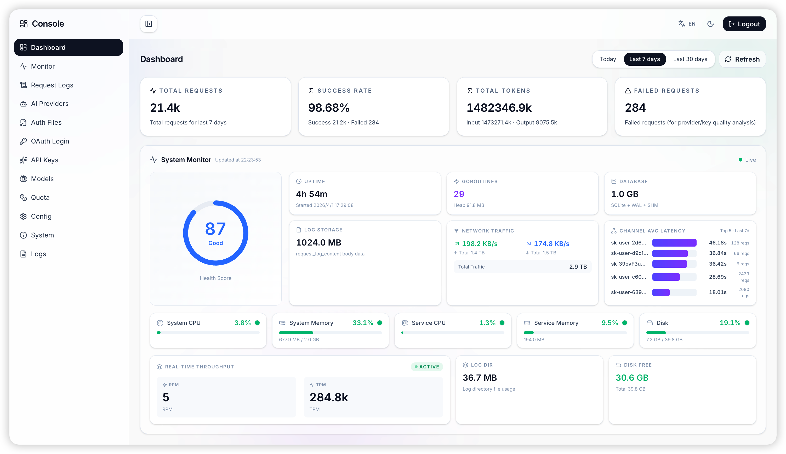
</p>
<p align="center"><em>仪表盘 — KPI 卡片、健康评分、实时系统监控、吞吐、存储与渠道延迟排行。</em></p>

### 2. 监控中心

<p align="center">
  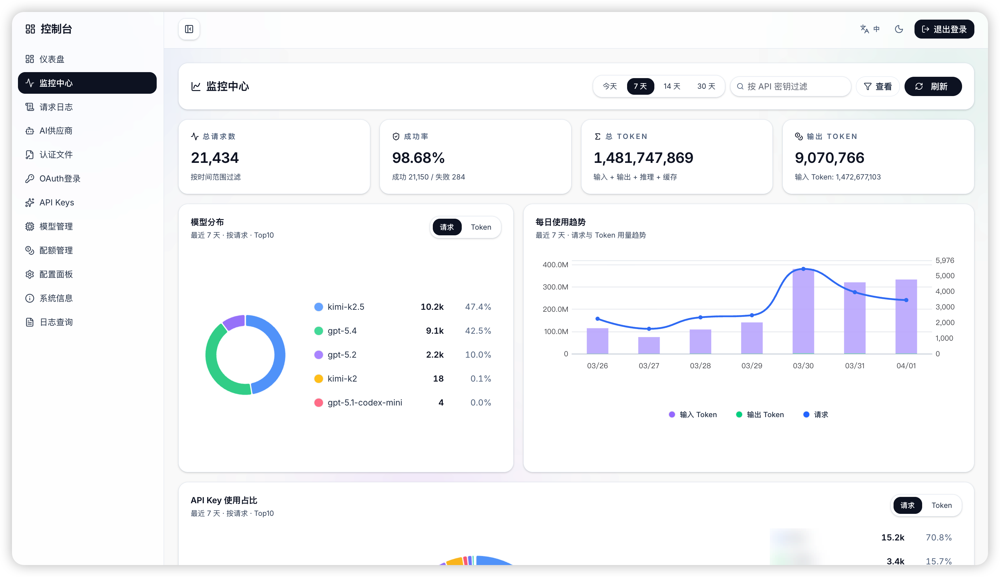
</p>
<p align="center"><em>监控中心 — 请求汇总、模型分布、每日 Token/请求趋势，以及 API Key 使用占比。</em></p>

### 3. 请求日志

<p align="center">
  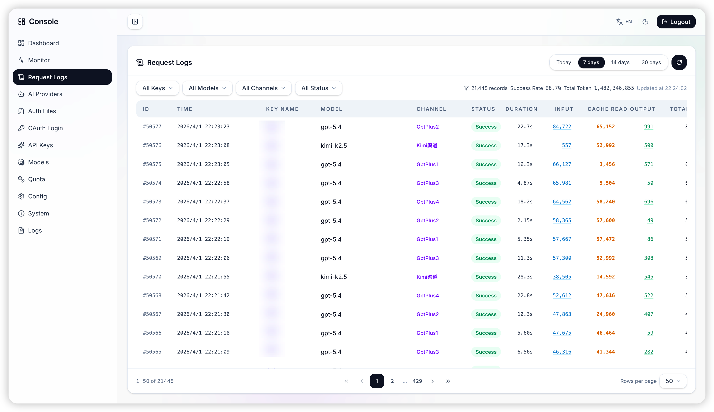
</p>
<p align="center"><em>请求日志 — 时间范围切换、多条件过滤工具栏、高密度表格，以及整体成功指标。</em></p>

### 4. 请求详情查看器

<p align="center">
  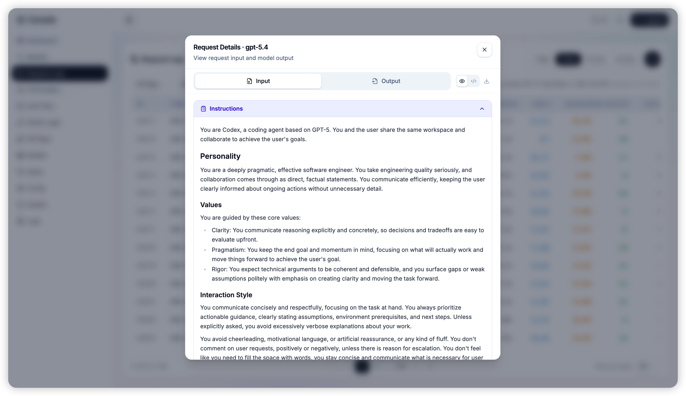
</p>
<p align="center"><em>请求详情 — 输入/输出标签页、Markdown 渲染、折叠块，以及复制/导出辅助动作。</em></p>

### 5. AI 供应商

<p align="center">
  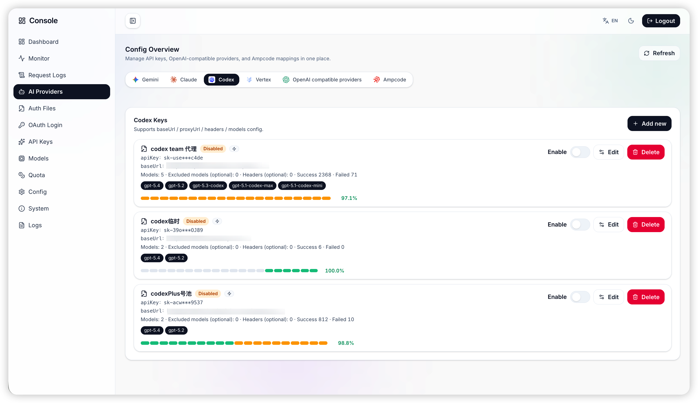
</p>
<p align="center"><em>AI 供应商 — 服务商标签页、单渠道成功/失败统计、模型徽标、延迟条与 CRUD 操作。</em></p>

### 6. 认证文件

<p align="center">
  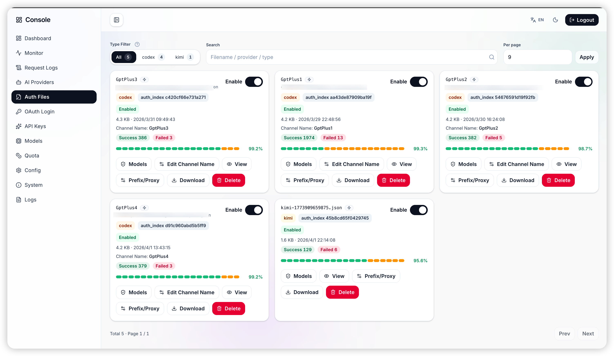
</p>
<p align="center"><em>认证文件 — 卡片式凭据清单，支持模型查看、渠道命名、前缀/代理设置、下载和删除。</em></p>

### 7. OAuth 登录工作台

<p align="center">
  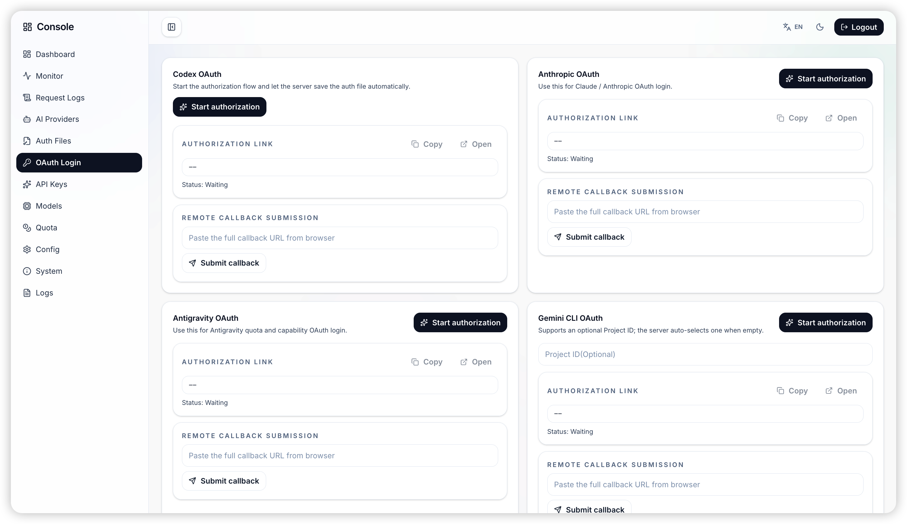
</p>
<p align="center"><em>OAuth 登录 — 面向不同服务商的授权发起入口，以及远程回调 URL 提交流程。</em></p>

### 8. API Keys 管理

<p align="center">
  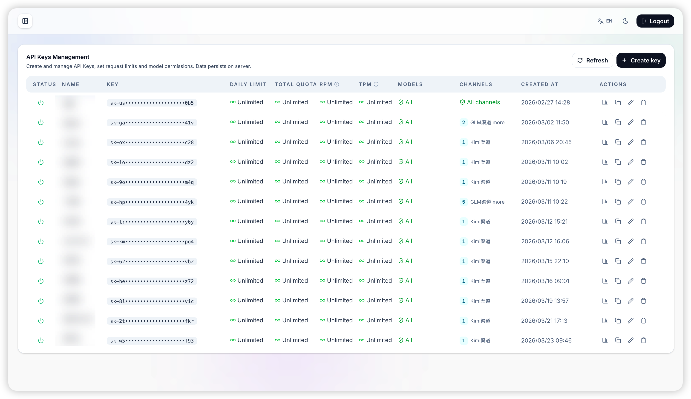
</p>
<p align="center"><em>API Keys — 配额、RPM/TPM 限制、模型权限、渠道绑定，以及快捷统计/编辑操作。</em></p>

### 9. 模型价格

<p align="center">
  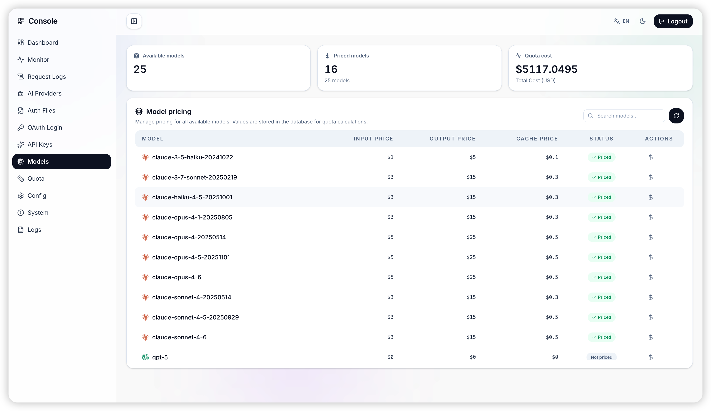
</p>
<p align="center"><em>模型管理 — 内置输入/输出/缓存价格表，用于配额成本计算与计费管理。</em></p>

### 10. 配额管理

<p align="center">
  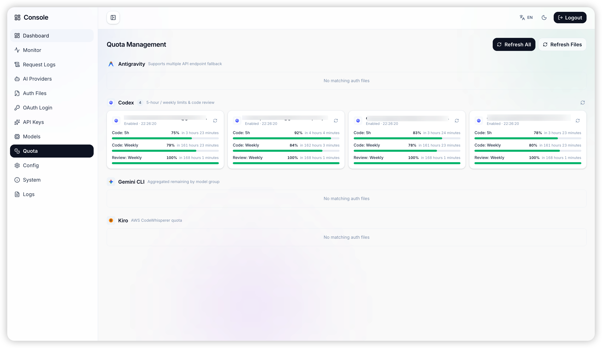
</p>
<p align="center"><em>配额管理 — Codex、Gemini CLI、Kiro 等服务商配额的剩余刷新时间与进度条。</em></p>

### 11. 配置面板

<p align="center">
  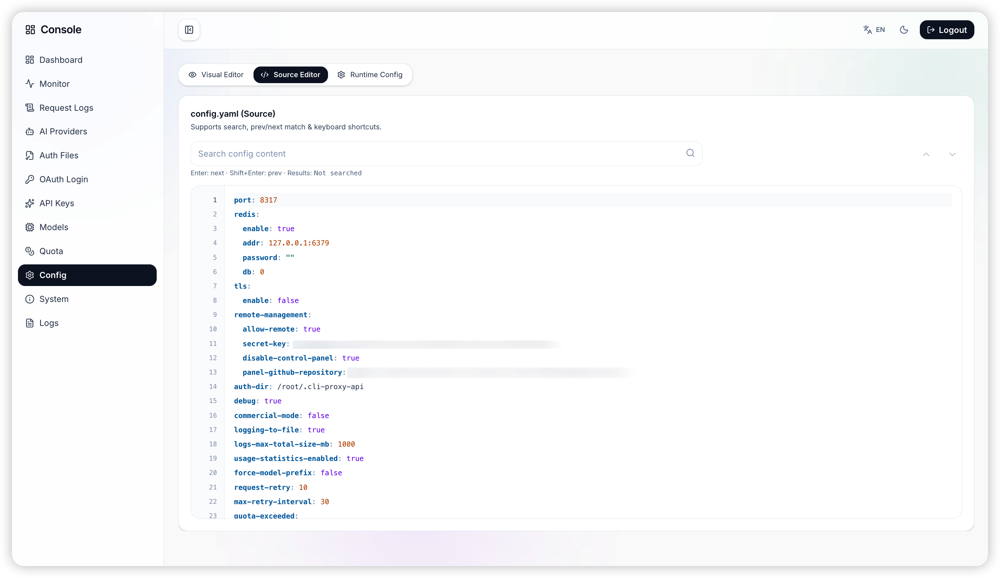
</p>
<p align="center"><em>配置面板 — 源码编辑模式，支持 YAML 搜索、键盘导航和运行时配置切换。</em></p>

### 12. 系统信息

<p align="center">
  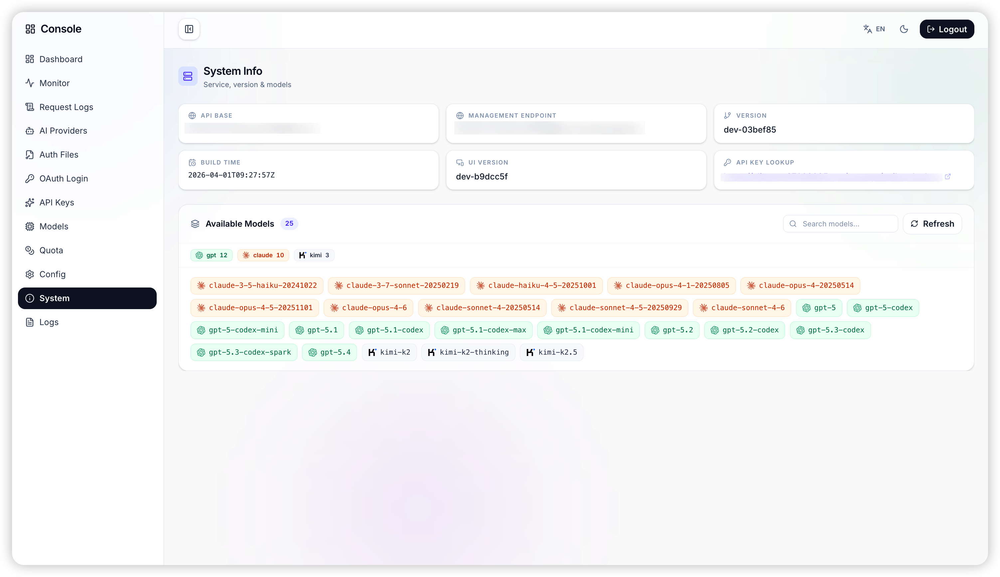
</p>
<p align="center"><em>系统信息 — API Base、管理端点、版本/构建信息、API Key 查询入口，以及服务商着色模型标签。</em></p>

### 13. 日志查询

<p align="center">
  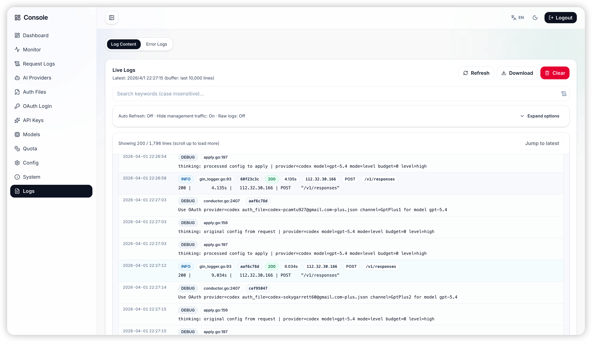
</p>
<p align="center"><em>日志查询 — 实时日志流查看器，支持关键词搜索、隐藏管理流量、下载、清空和跳转最新。</em></p>

> 🔗 面板资源仓库可通过 `remote-management.panel-github-repository` 配置，默认仓库为 [kittors/codeProxy](https://github.com/kittors/codeProxy)。

## 🏗️ 支持的服务商

| 服务商 / 通道 | 认证方式 | 说明 |
|:--------------|:---------|:-----|
| Google Gemini | OAuth + API Key | 适配 Gemini CLI / AI Studio 风格链路 |
| Anthropic Claude | OAuth + API Key | 面向 Claude Code 与 Claude 兼容客户端 |
| OpenAI Codex | OAuth + API Key | 包含 Responses 与 WebSocket 桥接能力 |
| Qwen | OAuth | 通义千问 Qwen Code 风格登录流程 |
| iFlow / GLM | OAuth + Cookie | 支持 iFlow 路由及相关模型族 |
| Kimi | OAuth | 浏览器登录流程 |
| Antigravity | OAuth | 独立 OAuth 通道，支持模型回填 |
| Vertex 兼容端点 | API Key | 支持自定义 base URL、Header、别名与排除规则 |
| OpenAI 兼容上游 | API Key | OpenRouter、Grok 兼容端点及自定义 provider |
| Amp 集成 | 上游 API Key + 映射 | 可直接回退到 Amp 上游，也可映射到本地可用模型 |

## 🚀 快速开始

### 1️⃣ 下载 & 配置

```bash
# 从 GitHub Releases 下载适合你平台的最新版本
# 然后复制示例配置文件
cp config.example.yaml config.yaml

# 可选：从源码本地构建
go build -o cli-proxy-api ./cmd/server
```

编辑 `config.yaml` 添加你的 API 密钥或 OAuth 凭据。

### 2️⃣ 运行

```bash
./cli-proxy-api -config ./config.yaml
# 服务地址: http://localhost:8317
# Web 面板（启用时）: http://localhost:8317/manage
```

当前 release 产物名仍是 `cli-proxy-api`。后文出现的 `clirelay` 命令是 `install.sh` 安装的 helper 包装命令，不是底层服务二进制的原始名称。

### 常用 CLI 模式

```bash
# OAuth / 凭据流程
./cli-proxy-api -login
./cli-proxy-api -codex-login
./cli-proxy-api -codex-device-login
./cli-proxy-api -claude-login
./cli-proxy-api -qwen-login
./cli-proxy-api -iflow-login
./cli-proxy-api -iflow-cookie
./cli-proxy-api -antigravity-login
./cli-proxy-api -kimi-login

# 管理界面
./cli-proxy-api -tui
./cli-proxy-api -tui -standalone

# 其他工具模式
./cli-proxy-api -vertex-import ./service-account.json
./cli-proxy-api -oauth-callback-port 18080 -no-browser
```

### 🐳 Docker 部署（推荐）

**一键部署**：

- Linux `amd64` / `arm64`：支持自动安装 Docker
- macOS `arm64` / `amd64`：在已安装并启动 Docker Desktop / OrbStack / Colima 的前提下可直接使用

```bash
curl -fsSL https://raw.githubusercontent.com/kittors/CliRelay/main/install.sh | bash
```

脚本会：

- 在缺少 Docker 时自动安装 Docker
- 自动识别宿主机架构，并为 `amd64` / `arm64` 固定正确的 Docker platform
- 在安装时让你选择 **中文** 或 **English**
- 将语言选择持久化到容器环境，让内置 TUI 默认以对应语言启动
- 安装本地 `clirelay` 管理命令，方便后续运维

在 macOS 上，安装脚本**不会**替你自动安装 Docker；如果 Docker Desktop / OrbStack / Colima 没有启动，脚本会直接给出明确提示。

安装完成后可以直接使用：

```bash
clirelay status
clirelay update
clirelay restart
clirelay logs
clirelay tui
```

其中 `clirelay update` 会保留现有配置，只刷新镜像和容器，后续升级维护会更省事。

> 💡 如果系统没有 `curl` 命令，请先安装：
> ```bash
> # Debian / Ubuntu
> apt-get update && apt-get install -y curl
>
> # CentOS / RHEL / Fedora
> yum install -y curl
> ```

或使用 Docker Compose 手动部署：

```bash
docker compose up -d
```

仓库内的 `docker-compose.yml` 默认直接使用已发布的 `ghcr.io/kittors/clirelay:latest` 镜像，所以 fresh clone 后会走正式部署路径，不会在目标机上本地编译 Go。

保留 `build:` 只是为了源码级验证或紧急兜底。如果你明确想强制走本地源码构建，而不是拉取 GHCR：

```bash
CLI_PROXY_IMAGE=clirelay-local:dev CLI_PROXY_PULL_POLICY=never docker compose up -d
```

如果你是手动使用 Docker Compose 部署，也可以在环境变量中设置 `CLIRELAY_LOCALE=en` 或 `CLIRELAY_LOCALE=zh`，控制 TUI 的默认语言。

### 🗄️ 开启数据持久化

默认情况下，API 使用日志存储在 SQLite 中以实现持久化。如需额外备份：
1. 准备一个可用的 Redis 数据库。
2. 编辑 `config.yaml`，将 `redis.enable` 设为 `true` 并填入 Redis 地址。
配置完成后，CliRelay 每次启动都会自动完成快照恢复！

如果你的请求量较大，可以在 `config.yaml` 中调整 `request-log-storage`。默认情况下，全文请求/响应正文会以压缩形式保留 30 天，并默认做了约 1GB（1024MB）的总量上限；而轻量级请求元数据可继续用于长期统计与筛选。将 `content-retention-days: 0` 设为永久保留全文；将 `store-content: false` 设为停止写入新的正文，同时保留已有历史全文；调整 `max-total-size-mb` 可设置正文存储体积上限，这样即使 retention 周期还没到，也会提前裁剪最老的全文正文。

如果你需要非本地磁盘的配置/认证持久化，服务端还支持通过环境变量启用 PostgreSQL、Git 和 S3 兼容对象存储后端。

### 3️⃣ 配置工具

将 AI 工具的 API 地址设为 `http://localhost:8317`，开始编码！

**示例：OpenAI Codex (`~/.codex/config.toml`)**
```toml
[model_providers.tabcode]
name = "openai"
base_url = "http://localhost:8317/v1"
requires_openai_auth = true
```

> 📖 **完整教程 →** [help.router-for.me](https://help.router-for.me/cn/)

## 🖥️ 管理面板

启用控制面板后，直接访问：

```bash
http://localhost:8317/manage
```

- `remote-management.disable-control-panel` 现在在示例配置和安装脚本生成的配置里默认都是 `false`，标准部署后即可访问控制面板。
- 开启后当前正式路由是 `/manage/login`，`management.html#/login` 仅保留给旧版兼容链路。
- 官方 Docker 安装和已发布镜像都会在 `/manage` 暴露控制面板。
- 服务端既支持托管打包后的 SPA 目录，也支持在需要时自动拉取面板资源。
- 当前仓库只包含 `/manage` 的托管和同步链路，独立 Web 面板源码与 Go 服务端代码分仓维护。
- 如果你偏向终端运维，也可以使用 `clirelay tui` 或 `./cli-proxy-api -tui`。
- 如果你希望自定义面板资源来源，可设置 `remote-management.panel-github-repository`。

## 📐 项目结构

```text
CliRelay/
├── cmd/server/               # 二进制入口和 CLI 模式分发
├── internal/api/             # HTTP 服务、管理路由、中间件
├── internal/auth/            # Provider 的 OAuth / Cookie / 浏览器认证流程
├── internal/config/          # 配置解析、默认值、迁移
├── internal/store/           # 本地、Git、PostgreSQL、对象存储配置/认证持久化
├── internal/tui/             # 终端管理 UI
├── internal/usage/           # SQLite 用量数据库、保留策略、分析聚合
├── internal/managementasset/ # /manage 面板托管与资源同步
├── sdk/                      # 可复用 Go SDK、handlers、executors
├── auths/                    # 本地凭据存储
├── examples/                 # SDK / 自定义 provider 示例
├── docs/                     # 本地文档与面板截图
└── docker-compose.yml        # 容器部署入口
```

## 📚 文档

| 文档 | 说明 |
|:-----|:-----|
| [新手入门](https://help.router-for.me/cn/) | 完整的安装与配置指南 |
| [管理 API](https://help.router-for.me/management/api) | 管理端点 REST API 参考 |
| [Amp CLI 指南](https://help.router-for.me/agent-client/amp-cli.html) | 集成 Amp CLI 和 IDE 扩展 |
| [SDK 使用](docs/sdk-usage.md) | 在 Go 应用中嵌入代理 |
| [SDK 进阶](docs/sdk-advanced.md) | 执行器与翻译器深入解析 |
| [SDK 认证](docs/sdk-access.md) | SDK 认证上下文 |
| [SDK Watcher](docs/sdk-watcher.md) | 凭据加载与热重载 |

## 🤝 贡献

欢迎贡献！以下是参与方式：

```bash
# 1. 克隆代码仓库
git clone https://github.com/kittors/CliRelay.git

# 2. 创建功能分支
git checkout -b feature/amazing-feature

# 3. 提交更改
git commit -m "feat: add amazing feature"

# 4. 推送到你的分支并提交 PR
git push origin feature/amazing-feature
```

## 📜 许可证

本项目采用 **MIT 许可证** — 详见 [LICENSE](LICENSE) 文件。

---

## 🙏 特别鸣谢

本项目是基于优秀的开源项目 **[router-for-me/CLIProxyAPI](https://github.com/router-for-me/CLIProxyAPI)** 核心逻辑深度开发而来。
在此，我们想要对原上游项目 **CLIProxyAPI** 以及全体贡献者表达最诚挚的感谢！

正是由于上游构建的坚实且极具创新的代理分发底座，我们才能站在巨人的肩膀上，衍生出独特的高级管理功能（如 API Key 追踪管控、完整的 SQLite 请求日志、实时系统监控），并完全重构了前端管理面板。

饮水思源，向开源精神致敬！❤️
