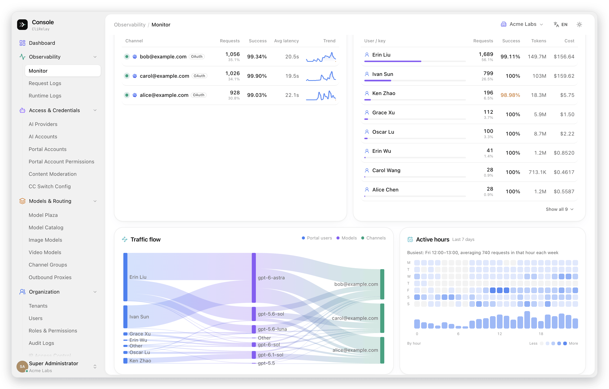
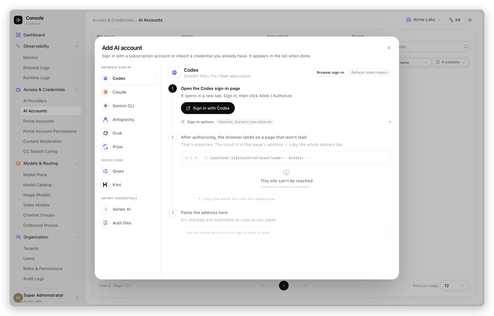
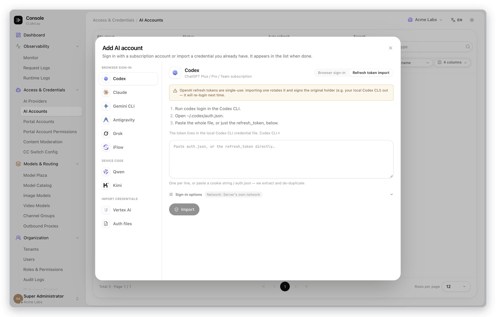
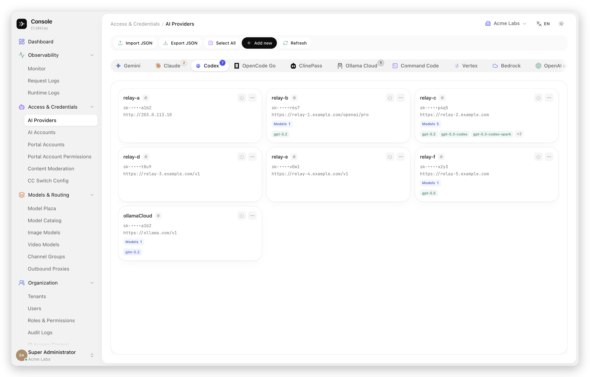
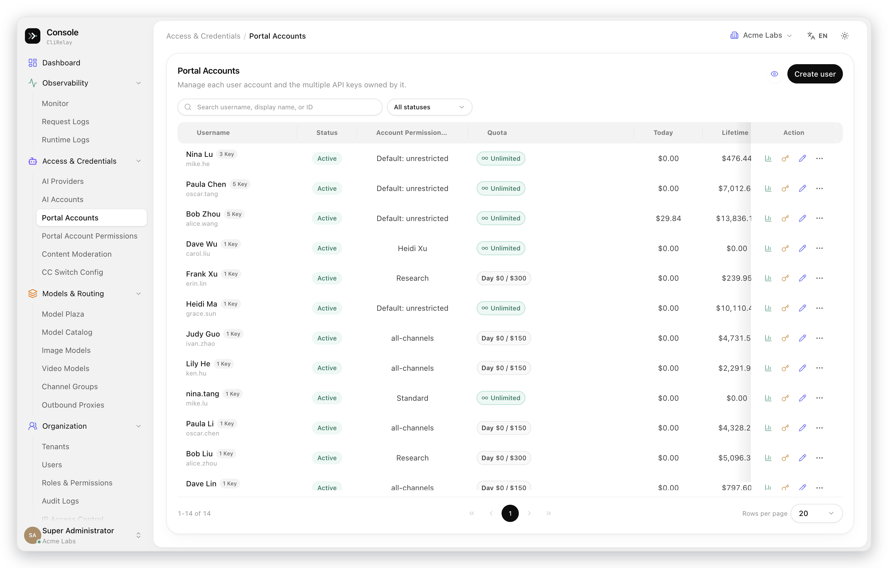
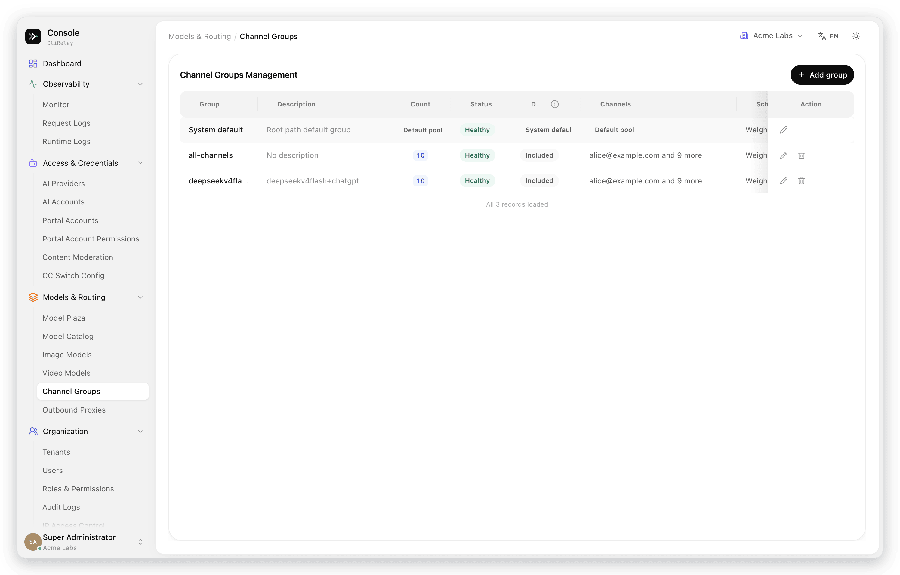
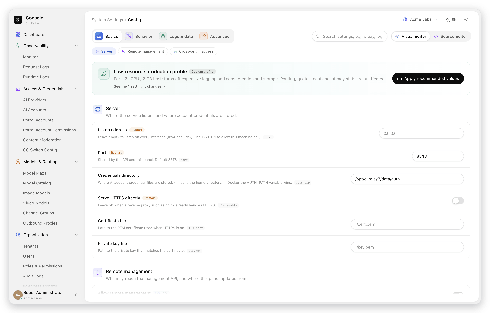
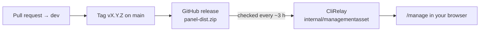

<p align="center">
  
  
  
  
  
</p>

<h1 align="center">codeProxy · CliRelay Control Panel</h1>

<p align="center">
  <strong>The web console for <a href="https://github.com/kittors/CliRelay">CliRelay</a> — monitor traffic, manage AI accounts and keys, and run a multi-tenant AI gateway from the browser.</strong>
</p>

<p align="center">
  <a href="https://github.com/kittors/codeProxy/releases"></a>
  <a href="https://github.com/kittors/codeProxy/stargazers"></a>
  <a href="https://github.com/kittors/codeProxy/issues"></a>
</p>

<p align="center">
  
</p>

---

## Contents

- [What it is](#what-it-is)
- [Highlights](#highlights)
- [Screenshots](#screenshots)
- [How the panel reaches your server](#how-the-panel-reaches-your-server)
- [Develop locally](#develop-locally)
- [Quality gates](#quality-gates)
- [Project structure](#project-structure)
- [Internationalization](#internationalization)
- [Tech stack](#tech-stack)
- [Talking to CliRelay](#talking-to-clirelay)
- [Contributing](#contributing)
- [License](#license)

## What it is

codeProxy is the official management panel for **[CliRelay](https://github.com/kittors/CliRelay)**, a self-hosted gateway that puts AI coding subscriptions (Claude, Codex, Gemini CLI, Antigravity, Grok, Qwen, Kimi…) and provider API keys behind one OpenAI / Anthropic / Gemini-compatible endpoint.

The panel is a single-page React application. CliRelay serves it at **`/manage`** and keeps it up to date on its own, so most people never build it: install CliRelay, open `http://your-host:8317/manage`, and sign in. This repository is for changing the panel itself.

## Highlights

| | |
| :-- | :-- |
| 📈 **Monitor center** | A health score with a per-check diagnosis, per-minute live traffic, six golden-signal tiles with period-over-period deltas, P50–P99 latency and time to first token, failure analysis, rankings, a portal user → model → channel traffic flow and an activity heatmap. |
| 🔑 **Guided account setup** | One "Add AI account" dialog for browser sign-in, device codes and credential import, with the real steps for each provider and checks before anything is sent; bulk import of held credentials. |
| 💳 **Keys, quotas and spend** | Portal accounts that own several client keys, reusable permission profiles, daily / period / lifetime quotas, rate limits and one-click period resets. |
| 🧭 **Models and routing** | A model plaza and catalog with capabilities and pricing, channel groups with scheduling and health, and a reusable outbound proxy pool. |
| 🏛️ **Multi-tenant governance** | Tenants, users, roles with `resource.action` permissions, per-tenant menus and an audit trail. |
| 🧩 **Forms that explain themselves** | Dialogs with icon headers, consequences spelled out before destructive actions, inline validation, and a config editor that switches between grouped forms and YAML. |
| 🌗 **Comfortable to live in** | Light and dark themes, a collapsible sidebar (⌘B / Ctrl+B), responsive layouts down to phones, and English, Simplified Chinese and Russian. |

## Screenshots

Taken from a live deployment; names, keys, addresses and accounts are replaced with sample values. The [CliRelay README](https://github.com/kittors/CliRelay#a-tour-of-the-control-panel) has a page-by-page tour with more screens.

| Monitor center — traffic flow and rankings | Dark theme |
| :-- | :-- |
|  |  |

| Dashboard | Request logs |
| :-- | :-- |
|  |  |

| Add an AI account | Import held credentials in bulk |
| :-- | :-- |
|  |  |

| AI accounts | AI providers |
| :-- | :-- |
|  |  |

| Portal accounts | Model plaza |
| :-- | :-- |
|  |  |

| Channel groups | Config |
| :-- | :-- |
|  |  |

| Sign-in |
| :-- |
|  |

## How the panel reaches your server



- A tagged release builds the panel and attaches **`panel-dist.zip`** (`manage.html` plus `assets/`).
- CliRelay checks the latest release of the configured repository (`remote-management.panel-github-repository`, default `kittors/codeProxy`) about every three hours, downloads it and serves it at `/manage`. You can also point CliRelay at a local build directory.
- **A panel release reaches every self-hosted backend, including older ones.** Features that need a newer backend detect it and degrade instead of failing — the monitor center falls back to a daily view built from `/usage/chart-data`, sign-in steps are inferred from the issued URL, and credential import asks for a backend update. Keep that rule for new features: if the panel depends on a new backend field, have the backend advertise it and hide the feature until it does.

## Develop locally

Prerequisites: [Bun](https://bun.sh/) 1.2+ and a CliRelay backend on `http://localhost:8317` (the dev server proxies `/v0`, `/v1` and `/v1beta` to it).

```bash
git clone https://github.com/kittors/codeProxy.git
cd codeProxy
bun install
bun run dev        # http://localhost:5173/manage/
```

```bash
bun run build      # type-check (tsc --noEmit) and build into dist/
bun run preview    # serve the production build
```

> [!TIP]
> For layout and interaction work you do not need a real backend or a real sign-in. The Playwright specs in `e2e/` show the pattern: seed the auth state in `localStorage` with `page.addInitScript()` and answer `/v0/management/**` with `page.route()`. Session tokens in mocks must start with `cps_`, as real ones do.

## Quality gates

Pull requests into `dev` run the same script as CI:

```bash
./scripts/ci-pr.sh
```

| Step | Command | What it guards |
| :-- | :-- | :-- |
| Lint | `bun run lint` | oxlint rules across the monorepo |
| Design scale | `bun run design:check` | Font sizes and corner radii stay on the global scale |
| Import boundaries | `bun run boundary:imports` | Packages only import what their layer allows |
| File size ratchet | `bun run size:check` | New files stay under 800 lines; files over it may only shrink |
| Surface usage | `bun run surface:check` | Cards and surfaces come from the shared primitives |
| Dependency audit | `bun run audit:deps` | No unwaived high or critical advisories |
| Unit tests | `bun run test:ci` | Full Vitest suite, run serially |
| Build | `bun run build` | Type-check and production build |
| Bundle diff | `bun run bundle:diff` | Gzip size of tracked chunks against `docs/internal-review/bundle-baseline.md` |
| Critical e2e | Playwright `@critical` | Sign-in and multi-tenant flows (`SKIP_E2E_CRITICAL=1` skips it locally) |

## Project structure

```text
apps/admin-panel/   Vite application: shell, router, guards, layout, bootstrap, global styles
pages/              One folder per route, with page-private components, hooks and tests
features/           Workflows shared by several pages (OAuth sign-in, log viewer, routing editor…)
packages/
├── api-client/     Management API client, typed endpoints and DTOs
├── assets/         Vendor icons and shared static assets
├── domain/         Pure business logic: formatters, pricing, quota and identity rules
├── i18n/           i18next setup and the en / zh-CN / ru locales
├── test-utils/     Shared test helpers
└── ui/             Design system: primitives, overlays, DataTable, charts, theme
e2e/                Playwright specs with mocked management APIs
scripts/            Repository gates (size, boundaries, design tokens, audit, bundle diff)
tooling/            Vite plugins and build-time helpers
```

## Internationalization

- Locales live in `packages/i18n/src/locales/{en,zh-CN,ru}.json`. Chinese browsers start in Chinese and others in English; the header switches between all three, and the choice is remembered.
- Missing keys fall back to English, then Chinese (`fallbackLng: ["en", "zh-CN"]`), so a new feature can ship in `en` and `zh-CN` first.
- Russian is complete. `ru-translation-coverage.test.ts` fails if a value is copied from English instead of being translated; names and identifiers that read the same in Russian are listed in its allowlist with a reason.
- Plurals use i18next suffixes. Russian needs `_one`, `_few`, `_many` and `_other`; a key called with `count` that has no plural variants must be worded so it reads right for any number («Выбрано: {{count}}»).

## Tech stack

| Area | Technology |
| :-- | :-- |
| Framework | React 19.2, TypeScript 5.9 |
| Build | Vite 7.3, Bun 1.2 workspaces |
| Styling | Tailwind CSS 4.1 with design tokens, shared `@code-proxy/ui` primitives |
| Routing and state | React Router 7, Zustand 5 |
| Data | Typed management API client over `fetch`, WebSocket system stats |
| Charts | Apache ECharts 6 |
| Motion and icons | Framer Motion 12, Lucide |
| Tables and content | TanStack Virtual, react-markdown with GFM, syntax highlighting, YAML |
| i18n | i18next 25, react-i18next |
| Quality | Vitest 4, Testing Library, Playwright 1.58, oxlint, oxfmt |

## Talking to CliRelay

The panel uses CliRelay's management API under `{apiBase}/v0/management` (the base is normalised automatically), plus `/v0/auth` for sessions and `/v0/portal` for the end-user portal. The main groups:

| Area | Endpoints |
| :-- | :-- |
| Session and identity | `/v0/auth/*`, `/tenants`, `/users`, `/roles`, `/menus`, `/audit-logs` |
| Monitoring | `/usage/monitor/overview`, `/usage/monitor/realtime`, `/usage/chart-data`, `/usage/logs`, `/system-stats/ws` |
| AI accounts and providers | `/auth-files`, `/*-auth-url`, `/oauth-import/*`, `/*-api-key`, `/openai-compatibility` |
| Keys and quotas | `/end-users`, `/api-key-entries`, `/api-key-permission-profiles` |
| Models and routing | `/model-configs`, `/routing-config`, `/channel-groups`, `/proxy-pool` |
| Configuration and system | `/config`, `/config.yaml`, `/update/*`, `/logs` |

The full reference is in the [CliRelay management API docs](https://help.router-for.me/management/api).

## Contributing

1. Branch from the latest `dev` (`git switch -c feat/your-change origin/dev`).
2. Keep changes inside the layer they belong to (`pages/` → `features/` → `packages/`) and add or update tests next to the code.
3. Run `./scripts/ci-pr.sh` (or the steps above) and open a pull request against `dev`.

Related: [CliRelay](https://github.com/kittors/CliRelay) (the Go backend) · [CliRelay guides](https://help.router-for.me/).

## License

No license file has been published for this repository yet. CliRelay, which serves this panel, is released under the [MIT License](https://github.com/kittors/CliRelay/blob/main/LICENSE).
